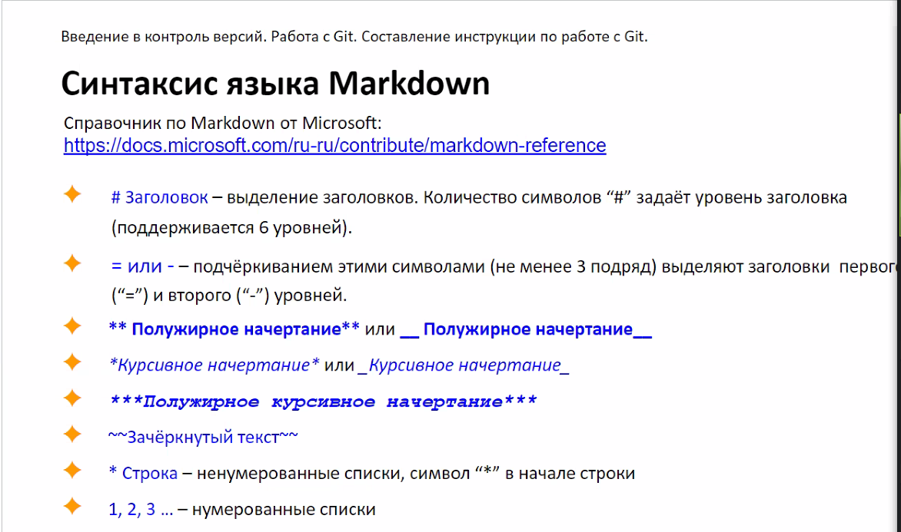

# ИНСТРУКЦИЯ

## Синтаксис языка Markdown

* Выделение заголовков. Количество символов (#)  задает уровень заголовка (до 6 уровней), ставится в начале.

* Подчеркивание текста (не менее 3 подряд) выделяют заголовки первого ("=") и второго ("-") уровней.

* Полужирное начертание - символы (**) или (__) ставятся в начале и конце текста. Пример: **полужирный** или __полужирный__.

* Курсивное начерание - символы (*) или (_) ставятся в начале и конце текста. Пример: *курсив* или _курсив_.

* Полужирное курсивное начертание - символы (***) или (___) ставятся в начале и конце текста. Пример: ***полужирный курсив*** или ___полужирный курсив___.

* Комбинированный текст - текст совмещает все три способа указанные выше. Пример: _***Комбинированный текст*** - текст совмещает все_ **три способа**.

* Зачерунутый текст - символы (~~) ставятся в начале и конце текста. Пример: ~~зачёркунутый текст~~.

* Ненумерованные списки, символ (*) в начале строки.

* Нумерованные списки - цифры, после цифры ставится точка

* ctrl + S - сохранение текущего состояния перерд фиксацией (git add), без сохранения не зафиксируется, без фиксации не закомичется.

## Работа с изображениями

Чтобы вставить изображение в текст необходимо: 
. Пример: 

## Команды git

1. **git init** - инициализирует создание репозитория в данной папке (без этого git не работает).

2. **git status** - отражает текущее состояние репозитория. Показывает файлы, в которых были произведены изменения, удалённые и новые, требующие добавления.

3. **git config --global user.name "User Name"** - для авторизации ввести имя. Вводится один раз. При необходимости в другом репозитарии для отображения вводится другое имя без --global.

4. **git config --global user.email mail@gmail.com** - для авторизации ввести адрес эл.почты. Вводится один раз. Эл.адрес должен совпадать с тем, на который зарегистрирован аккаунт в Гитхабе.

5. **git config --global core.editor editor** - установка текстового редактора, в котором будут открываться файлы для решения конфликтов.

6. **git config --list** - просмотр всех установленных настроек.

7. **git add название файла** - фиксирует изменения в этом файле.

    * 7.1. **git add .** - фиксирует все измменения в репозитории.
    * 7.2. **git add -A** - добавляет удалённые файлы из текущей директории и из всего локального репозитория.

8. **git rm название файла** - удаляет файлы по их имени.

9. **git reset** - отменяет все незафиксированные изменения по умолчанию только из индекса.

    * 9.1. **git reset --hard** - безвозвратно удаляет незафиксированные текущие изменения из локального репозитория и из индекса.

10. **git commit -m "название изменения"** - сохраняет фиксированные изменения.

11. **git log** - отражает все коммиты, созданные в этой ветке.

12. **git diff** - разница между текущим файлом и закомиченным. 

13. **git branch** - список веток в локальном репозитории.

    * 13.1. **git branch -r** - список всех существующих веток удалённого репозитория.
    * 13.2. **git branch название ветки** - создать новую ветку.
    * 13.3. **git branch -d название ветки** - удалить ветку.

14. **git checkout название ветки** - перейти в друю ветку (если на конце ввести первые четыре знака коммита то переходим на него).

    * 14.1. **git checkout -b название ветки** создаёт ветку с указанным именем и автоматически переключит на неё.
    * 14.2. **git checkout origin/branch-name -b branch-name** - переносит на компьютер ветку с удалённого репозитория.

15. **git clone** - клонирование репозитория.

16. **git pull** - получить последнюю версию удалённого репозитория. _**Будьте внимательны, вызов этой команды сотрёт все незафиксированные изменения.**_

17. **git push** - отправляет все зафиксированные изменения на удалённый (другой) репозиторий.

    * 17.1 **git push origin название ветки** - отправляет ветку на сервер

18. **git clean -f -d** - удаляет ненужные, неотслеживаемые файлы и прочий мусор.

19. **git cherry -v master** - какие коммиты у вас прибавились по сравнению с веткой master.

20. **git cherry -v master** - количество коммитов